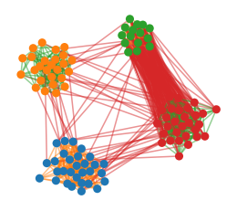
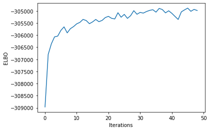
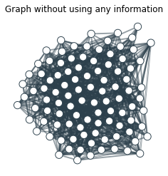
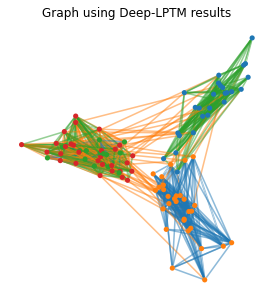

# Simulation


```python
import pickle
import numpy as np
import pandas as pd
from numpy.random import default_rng
from sklearn.datasets import fetch_20newsgroups
from sklearn.feature_extraction.text import CountVectorizer
import gensim
import os
from IPython.display import clear_output
from functions import one_hot
from ETM_raw.scripts.data_preprocessing import *
from Simulations import Simulation_BBC
from IPython.display import clear_output
rng = default_rng(seed = 2)
```


```python
import os
#from Simulations_BBC import Simulation_BBC
from ETM_raw.scripts.data_preprocessing import preprocessing
np.set_printoptions(precision=2)

# To begin with
SIMULATIONS_root = 'Simulations/'
BBC_root         = os.path.join(SIMULATIONS_root, 'bbc')

scenario             = 'ScenarioC'
simulate_new_dataset = False

if simulate_new_dataset:
    # Not working properly. Different results than with R dataset with the same parameters. To investigate.
    simu_path        = os.path.join(BBC_root, scenario)
    Q, K, A, T, W, pi, node_cluster, topics =Simulation_BBC(BBC_root, 
                                                            save_path=simu_path,
                                                            N=100,
                                                            scenario='ScenarioB',
                                                            difficulty = 'Easy',
                                                            verbose=True)
    topics = T[A != 0]
else:
    simu_path        = os.path.join(BBC_root, scenario, '1/')
    A                = pd.read_csv(os.path.join(simu_path, 'adjacency.csv'),
                           index_col=None, header=None, sep=';').to_numpy()
    node_cluster     = pd.read_csv(os.path.join(simu_path, 'clusters.csv'),
                           index_col=None, header=None,sep=';').to_numpy().squeeze() - 1
    W                = pd.read_csv(os.path.join(simu_path, 'texts.csv'),
                           index_col=None, header=None, sep='/').to_numpy()
    T                = pd.read_csv(os.path.join(simu_path, 'topics.csv'),
                           index_col=None, header=None, sep=';').to_numpy()
    
    topics   = T[A != 0] - 1
    K        = np.unique(topics).shape[0]
    Q        = np.unique(node_cluster).shape[0]
    W        = W[A != 0].tolist()
    #args.hidden2_dim = 3
    N = A.shape[0]
    M = A.sum()
    
# Preprocess the texts using ETM preprocessing tools
etm_path = os.path.join(simu_path, 'etm/')
  
```

# Representation of the data


```python
import networkx as nx
from netgraph import Graph
import matplotlib.pyplot as plt
G = nx.DiGraph()
edges = np.where(A)
for (i, j) in zip(edges[0].tolist(), edges[1].tolist()):
    G.add_edge(i, j)
    
    
community_to_color = {
    0 : 'tab:blue',
    1 : 'tab:orange',
    2 : 'tab:green',
    3 : 'tab:red',
}

node_to_cluster = {node: node_cluster[node] for node in G.nodes}
edge_to_topic   = {(i,j):T[i,j] for (i,j) in zip(edges[0], edges[1])}

node_color = {node: community_to_color[cluster] for node, cluster in node_to_cluster.items()}
edge_color = {edge: community_to_color[topic] for edge, topic in edge_to_topic.items()}

Graph(G,
      node_color=node_color, node_edge_width=0, edge_alpha=0.5, edge_color = edge_color,
      node_layout='community', node_layout_kwargs=dict(node_to_community=node_to_cluster))
plt.show()
```

    C:\Users\remib\Anaconda3\envs\GCN\lib\site-packages\netgraph\_node_layout.py:993: RuntimeWarning: invalid value encountered in divide
      directions = deltas / magnitudes[:, np.newaxis]
    


    

    


```python
preprocessing(W, path_save=etm_path, max_df=1., min_df=1, prop_Tr=1, vaSize = 0)
```

    reading data...
    counting document frequency of words...
    building the vocabulary...
      initial vocabulary size: 799
      vocabulary size after removing stopwords from list: 595
    tokenizing documents and splitting into train/test/valid...
      vocabulary after removing words not in train: 595
      number of documents (train): 863 [this should be equal to 863]
      number of documents (test): 0 [this should be equal to 0]
      number of documents (valid): 0 [this should be equal to 0]
    removing empty documents...
    splitting test documents in 2 halves...
    creating lists of words...
      len(words_tr):  60922
      len(words_ts):  0
      len(words_ts_h1):  0
      len(words_ts_h2):  0
      len(words_va):  0
    getting doc indices...
      len(np.unique(doc_indices_tr)): 863 [this should be 863]
      len(np.unique(doc_indices_ts)): 0 [this should be 0]
      len(np.unique(doc_indices_ts_h1)): 0 [this should be 0]
      len(np.unique(doc_indices_ts_h2)): 0 [this should be 0]
      len(np.unique(doc_indices_va)): 0 [this should be 0]
    creating bow representation...
    splitting bow intro token/value pairs and saving to disk...
    Data ready !!
    *************
    

    C:\Users\remib\Anaconda3\envs\GCN\lib\site-packages\scipy\io\matlab\_mio5.py:493: VisibleDeprecationWarning: Creating an ndarray from ragged nested sequences (which is a list-or-tuple of lists-or-tuples-or ndarrays with different lengths or shapes) is deprecated. If you meant to do this, you must specify 'dtype=object' when creating the ndarray.
      narr = np.asanyarray(source)
    


```python
assert int(A.sum()) == len(W), 'The number of texts and edges is different. A simulation problem occured'
```

# Initialise ETM and Deep-LPM
If the models are not initialised, it might be more difficult to recover the true partition. In addition, the running time would be much more important to obtain interesting node positions. 

## ETM initialisation


```python
from ETM_raw.main import ETM_algo
import torch
from ETM_raw.data import get_batch
from sklearn.metrics import adjusted_rand_score as ARI

use_pretrained_emb = False
etm_init_epochs    = 5
seed               = 0 

etm = ETM_algo(data_path= etm_path,
               dataset='BBC',
               seed=seed,
               enc_drop=0,
               train_embeddings=True,
               use_pretrained_emb=use_pretrained_emb,
               emb_path=None,
               save_path=etm_path,
               batch_size=30,
               epochs=etm_init_epochs,
               num_topics=K)

etm.model.float()
etm.train_etm()
DTM = get_batch(etm.train_tokens, etm.train_counts, range(etm.train_tokens.shape[0]), len(etm.vocab), device='cuda')
DTM_norm = DTM / DTM.sum(1,keepdims=True)

theta, _ = etm.model.get_theta(DTM_norm)
theta    = theta.detach().cpu().numpy()
clear_output()

print('Documents ARI : {}'.format(ARI(topics, theta.argmax(-1))))        
torch.save(etm, os.path.join(etm_path, 'etm_init_pretrained_{}.pt'.format(int(use_pretrained_emb))))
```

    Documents ARI : 1.0
    

## Deep-LPM initialisation


```python
from os.path import join
from functions import DeepLPM_format
from deepLPM_main import model as Model
from deepLPM_main import args
from functions import training_graph_vectorization
from torch.optim import Adam

device = torch.device("cuda" if torch.cuda.is_available() else "cpu")

M = int(A.sum())
P = 2
N = int(A.shape[0])

"""
adj = np.load(join(simu_path, 'adjacency.npy'))
clusters = np.load(join(simu_path, 'clusters.npy'))

args.P = 2
args.K = K
args.num_clusters = Q
args.device = device
args.num_points= A.shape[0]
args.num_edges = int(A.sum())
"""


#args.K = K
args.P = 2
args.hidden2_dim = P
#args.M = M
#args.N = N
#args.Q = Q
args.num_clusters = Q
args.num_points   = N
args.K            = K
args.num_edges    = M
args.device       = device
adj, adj_label, adj_norm, features, edges, indices = DeepLPM_format(A, args)
args.indices = indices

deepLPM = getattr(Model, args.model)(adj_norm)
deepLPM.to(device)  # to GPU
deepLPM.pretrain(features, adj_label, edges, verbose=False)  # pretraining
optimizer = Adam(deepLPM.parameters(), lr=args.learning_rate)  # , weight_decay=0.01
deepLPM = deepLPM.to(device)

print('DeepLPM ARI : {}'.format(ARI(deepLPM.gamma.argmax(-1).detach().cpu().numpy(),
                                    node_cluster)))
```

    Finish pretraining!
    DeepLPM ARI : 0.4446642361863007
    

    C:\Users\remib\Anaconda3\envs\GCN\lib\site-packages\sklearn\cluster\_kmeans.py:1334: UserWarning: KMeans is known to have a memory leak on Windows with MKL, when there are less chunks than available threads. You can avoid it by setting the environment variable OMP_NUM_THREADS=1.
      warnings.warn(
    


```python
args.K            = K
args.num_edges    = M
```

# Deep-LPTM training


```python
results = training_graph_vectorization(adj_label,
                                       features,
                                       edges,
                                       optimizer,
                                       etm,
                                       deepLPM,
                                       args,
                                       labels=node_cluster,
                                       topics=T[A!=0],
                                       epochs=50,
                                       tol=1e-3,
                                       adj=A,
                                       ratio=False,
                                       use='all',
                                       init='dissimilarity', 
                                       init_path=None,
                                       full_batch = False,
                                       device=None)
```

    ARI of initialisation : 0.98
    Epoch----->0 .. LR: 0.005 .. KL_theta: 6.02 .. Rec_loss: 354.44 .. NELBO: 360.46
    ARI texts= 1.000
    ARI= 1.000
    Epoch: 0001 network_loss = 3264.00195 train_loss1= 3017.21191 train_loss2= 111.65942 train_loss3= 135.13063 KL texts = 0.119 recon loss texts = 354.111 time= 1.00 sec
    Epoch----->0 .. LR: 0.005 .. KL_theta: 0.82 .. Rec_loss: 352.68 .. NELBO: 353.5
    ARI texts= 1.000
    ARI= 1.000
    Epoch: 0002 network_loss = 3065.65649 train_loss1= 2818.95654 train_loss2= 111.72216 train_loss3= 134.97786 KL texts = 0.061 recon loss texts = 351.887 time= 0.86 sec
    Epoch----->0 .. LR: 0.005 .. KL_theta: 0.35 .. Rec_loss: 351.92 .. NELBO: 352.27
    ARI texts= 1.000
    ARI= 1.000
    Epoch: 0003 network_loss = 3239.00830 train_loss1= 2991.66821 train_loss2= 112.39246 train_loss3= 134.94756 KL texts = 0.039 recon loss texts = 351.200 time= 0.87 sec
    Epoch----->0 .. LR: 0.005 .. KL_theta: 0.13 .. Rec_loss: 351.5 .. NELBO: 351.63
    ARI texts= 1.000
    ARI= 1.000
    Epoch: 0004 network_loss = 3236.40039 train_loss1= 2988.45557 train_loss2= 112.97987 train_loss3= 134.96495 KL texts = 0.025 recon loss texts = 350.886 time= 0.91 sec
    Epoch----->0 .. LR: 0.005 .. KL_theta: 0.09 .. Rec_loss: 351.27 .. NELBO: 351.36
    ARI texts= 1.000
    ARI= 1.000
    Epoch: 0005 network_loss = 3295.78906 train_loss1= 3047.19043 train_loss2= 113.62530 train_loss3= 134.97343 KL texts = 0.015 recon loss texts = 350.790 time= 0.95 sec
    Epoch----->0 .. LR: 0.005 .. KL_theta: 0.06 .. Rec_loss: 351.1 .. NELBO: 351.16
    ARI texts= 1.000
    ARI= 1.000
    Epoch: 0006 network_loss = 3145.51611 train_loss1= 2896.24805 train_loss2= 114.28742 train_loss3= 134.98076 KL texts = 0.010 recon loss texts = 350.696 time= 0.88 sec
    Epoch----->0 .. LR: 0.005 .. KL_theta: 0.05 .. Rec_loss: 351.1 .. NELBO: 351.15
    ARI texts= 1.000
    ARI= 1.000
    Epoch: 0007 network_loss = 3118.51465 train_loss1= 2868.57666 train_loss2= 114.95022 train_loss3= 134.98772 KL texts = 0.008 recon loss texts = 350.560 time= 0.80 sec
    Epoch----->0 .. LR: 0.005 .. KL_theta: 0.04 .. Rec_loss: 350.91 .. NELBO: 350.95
    ARI texts= 1.000
    ARI= 1.000
    Epoch: 0008 network_loss = 3446.56104 train_loss1= 3195.94434 train_loss2= 115.62369 train_loss3= 134.99297 KL texts = 0.007 recon loss texts = 350.469 time= 0.94 sec
    Epoch----->0 .. LR: 0.005 .. KL_theta: 0.03 .. Rec_loss: 350.85 .. NELBO: 350.88
    ARI texts= 1.000
    ARI= 1.000
    Epoch: 0009 network_loss = 3260.70386 train_loss1= 3009.40771 train_loss2= 116.29861 train_loss3= 134.99750 KL texts = 0.005 recon loss texts = 350.485 time= 0.87 sec
    Epoch----->0 .. LR: 0.005 .. KL_theta: 0.03 .. Rec_loss: 350.98 .. NELBO: 351.01
    ARI texts= 1.000
    ARI= 1.000
    Epoch: 0010 network_loss = 3332.52002 train_loss1= 3080.58618 train_loss2= 116.93676 train_loss3= 134.99709 KL texts = 0.004 recon loss texts = 350.302 time= 0.88 sec
    Epoch----->0 .. LR: 0.005 .. KL_theta: 0.02 .. Rec_loss: 350.77 .. NELBO: 350.79
    ARI texts= 1.000
    ARI= 1.000
    Epoch: 0011 network_loss = 3218.67041 train_loss1= 2966.13135 train_loss2= 117.54115 train_loss3= 134.99780 KL texts = 0.004 recon loss texts = 350.303 time= 0.88 sec
    Epoch----->0 .. LR: 0.005 .. KL_theta: 0.02 .. Rec_loss: 350.81 .. NELBO: 350.83
    ARI texts= 1.000
    ARI= 1.000
    Epoch: 0012 network_loss = 3214.27856 train_loss1= 2961.17236 train_loss2= 118.10818 train_loss3= 134.99809 KL texts = 0.003 recon loss texts = 350.239 time= 0.82 sec
    Epoch----->0 .. LR: 0.005 .. KL_theta: 0.01 .. Rec_loss: 350.69 .. NELBO: 350.7
    ARI texts= 1.000
    ARI= 1.000
    Epoch: 0013 network_loss = 3108.60693 train_loss1= 2854.95508 train_loss2= 118.64900 train_loss3= 135.00278 KL texts = 0.002 recon loss texts = 350.220 time= 0.86 sec
    Epoch----->0 .. LR: 0.005 .. KL_theta: 0.02 .. Rec_loss: 350.64 .. NELBO: 350.66
    ARI texts= 1.000
    ARI= 1.000
    Epoch: 0014 network_loss = 3212.39575 train_loss1= 2958.19507 train_loss2= 119.19250 train_loss3= 135.00812 KL texts = 0.002 recon loss texts = 350.155 time= 0.87 sec
    Epoch----->0 .. LR: 0.005 .. KL_theta: 0.01 .. Rec_loss: 350.53 .. NELBO: 350.54
    ARI texts= 1.000
    ARI= 1.000
    Epoch: 0015 network_loss = 3358.27954 train_loss1= 3103.60059 train_loss2= 119.66644 train_loss3= 135.01241 KL texts = 0.002 recon loss texts = 350.137 time= 0.93 sec
    Epoch----->0 .. LR: 0.005 .. KL_theta: 0.01 .. Rec_loss: 350.62 .. NELBO: 350.63
    ARI texts= 1.000
    ARI= 1.000
    Epoch: 0016 network_loss = 3355.11523 train_loss1= 3099.93433 train_loss2= 120.16576 train_loss3= 135.01526 KL texts = 0.002 recon loss texts = 350.055 time= 0.89 sec
    Epoch----->0 .. LR: 0.005 .. KL_theta: 0.01 .. Rec_loss: 350.46 .. NELBO: 350.47
    ARI texts= 1.000
    ARI= 1.000
    Epoch: 0017 network_loss = 3250.71289 train_loss1= 2995.01318 train_loss2= 120.68380 train_loss3= 135.01588 KL texts = 0.002 recon loss texts = 350.059 time= 0.86 sec
    Epoch----->0 .. LR: 0.005 .. KL_theta: 0.01 .. Rec_loss: 350.51 .. NELBO: 350.52
    ARI texts= 1.000
    ARI= 1.000
    Epoch: 0018 network_loss = 3358.44263 train_loss1= 3102.26611 train_loss2= 121.15623 train_loss3= 135.02040 KL texts = 0.002 recon loss texts = 350.040 time= 0.95 sec
    Epoch----->0 .. LR: 0.005 .. KL_theta: 0.02 .. Rec_loss: 350.43 .. NELBO: 350.45
    ARI texts= 1.000
    ARI= 1.000
    Epoch: 0019 network_loss = 3293.90112 train_loss1= 3037.23779 train_loss2= 121.63737 train_loss3= 135.02602 KL texts = 0.003 recon loss texts = 350.055 time= 0.80 sec
    Epoch----->0 .. LR: 0.005 .. KL_theta: 0.01 .. Rec_loss: 350.53 .. NELBO: 350.54
    ARI texts= 1.000
    ARI= 1.000
    Epoch: 0020 network_loss = 3192.27051 train_loss1= 2935.10498 train_loss2= 122.14093 train_loss3= 135.02457 KL texts = 0.002 recon loss texts = 350.036 time= 0.83 sec
    Epoch----->0 .. LR: 0.005 .. KL_theta: 0.01 .. Rec_loss: 350.38 .. NELBO: 350.39
    ARI texts= 1.000
    ARI= 1.000
    Epoch: 0021 network_loss = 3178.76660 train_loss1= 2921.11255 train_loss2= 122.62784 train_loss3= 135.02629 KL texts = 0.002 recon loss texts = 349.994 time= 0.94 sec
    Epoch----->0 .. LR: 0.005 .. KL_theta: 0.02 .. Rec_loss: 350.49 .. NELBO: 350.51
    ARI texts= 1.000
    ARI= 1.000
    Epoch: 0022 network_loss = 3294.23706 train_loss1= 3036.06885 train_loss2= 123.13655 train_loss3= 135.03156 KL texts = 0.003 recon loss texts = 349.953 time= 0.82 sec
    Epoch----->0 .. LR: 0.005 .. KL_theta: 0.05 .. Rec_loss: 350.4 .. NELBO: 350.45
    ARI texts= 1.000
    ARI= 1.000
    Epoch: 0023 network_loss = 3299.68262 train_loss1= 3041.00781 train_loss2= 123.64282 train_loss3= 135.03201 KL texts = 0.004 recon loss texts = 349.975 time= 0.85 sec
    Epoch----->0 .. LR: 0.005 .. KL_theta: 0.04 .. Rec_loss: 350.4 .. NELBO: 350.44
    ARI texts= 1.000
    ARI= 1.000
    Epoch: 0024 network_loss = 3083.17822 train_loss1= 2823.99170 train_loss2= 124.15270 train_loss3= 135.03387 KL texts = 0.005 recon loss texts = 349.927 time= 0.96 sec
    Epoch----->0 .. LR: 0.005 .. KL_theta: 0.01 .. Rec_loss: 350.38 .. NELBO: 350.39
    ARI texts= 1.000
    ARI= 1.000
    Epoch: 0025 network_loss = 3280.04834 train_loss1= 3020.38745 train_loss2= 124.62235 train_loss3= 135.03856 KL texts = 0.003 recon loss texts = 349.917 time= 0.87 sec
    Epoch----->0 .. LR: 0.005 .. KL_theta: 0.02 .. Rec_loss: 350.39 .. NELBO: 350.41
    ARI texts= 1.000
    ARI= 1.000
    Epoch: 0026 network_loss = 3201.77954 train_loss1= 2941.65625 train_loss2= 125.08130 train_loss3= 135.04208 KL texts = 0.004 recon loss texts = 349.870 time= 0.81 sec
    Epoch----->0 .. LR: 0.005 .. KL_theta: 0.01 .. Rec_loss: 350.29 .. NELBO: 350.3
    ARI texts= 1.000
    ARI= 1.000
    Epoch: 0027 network_loss = 3322.75366 train_loss1= 3062.19092 train_loss2= 125.52364 train_loss3= 135.03903 KL texts = 0.002 recon loss texts = 349.924 time= 0.89 sec
    Epoch----->0 .. LR: 0.005 .. KL_theta: 0.02 .. Rec_loss: 350.31 .. NELBO: 350.33
    ARI texts= 1.000
    ARI= 1.000
    Epoch: 0028 network_loss = 3232.93140 train_loss1= 2971.92188 train_loss2= 125.96759 train_loss3= 135.04185 KL texts = 0.004 recon loss texts = 349.896 time= 0.88 sec
    Epoch----->0 .. LR: 0.005 .. KL_theta: 0.01 .. Rec_loss: 350.35 .. NELBO: 350.36
    ARI texts= 1.000
    ARI= 1.000
    Epoch: 0029 network_loss = 3075.69360 train_loss1= 2814.27686 train_loss2= 126.36714 train_loss3= 135.04953 KL texts = 0.002 recon loss texts = 349.841 time= 0.95 sec
    Epoch----->0 .. LR: 0.005 .. KL_theta: 0.01 .. Rec_loss: 350.18 .. NELBO: 350.19
    ARI texts= 1.000
    ARI= 1.000
    Epoch: 0030 network_loss = 3224.89697 train_loss1= 2963.10059 train_loss2= 126.74519 train_loss3= 135.05110 KL texts = 0.003 recon loss texts = 349.839 time= 0.97 sec
    Epoch----->0 .. LR: 0.005 .. KL_theta: 0.08 .. Rec_loss: 350.17 .. NELBO: 350.25
    ARI texts= 1.000
    ARI= 1.000
    Epoch: 0031 network_loss = 3100.46362 train_loss1= 2838.29517 train_loss2= 127.12611 train_loss3= 135.04234 KL texts = 0.009 recon loss texts = 349.889 time= 0.90 sec
    Epoch----->0 .. LR: 0.005 .. KL_theta: 0.06 .. Rec_loss: 350.27 .. NELBO: 350.33
    ARI texts= 1.000
    ARI= 1.000
    Epoch: 0032 network_loss = 3187.54248 train_loss1= 2925.05176 train_loss2= 127.45546 train_loss3= 135.03529 KL texts = 0.011 recon loss texts = 349.820 time= 0.88 sec
    Epoch----->0 .. LR: 0.005 .. KL_theta: 0.03 .. Rec_loss: 350.29 .. NELBO: 350.32
    ARI texts= 1.000
    ARI= 1.000
    Epoch: 0033 network_loss = 3081.17358 train_loss1= 2818.37939 train_loss2= 127.74196 train_loss3= 135.05231 KL texts = 0.005 recon loss texts = 349.874 time= 0.88 sec
    Epoch----->0 .. LR: 0.005 .. KL_theta: 0.01 .. Rec_loss: 350.27 .. NELBO: 350.28
    ARI texts= 1.000
    ARI= 1.000
    Epoch: 0034 network_loss = 3078.74976 train_loss1= 2815.65088 train_loss2= 128.04071 train_loss3= 135.05806 KL texts = 0.003 recon loss texts = 349.823 time= 0.89 sec
    Epoch----->0 .. LR: 0.005 .. KL_theta: 0.01 .. Rec_loss: 350.37 .. NELBO: 350.38
    ARI texts= 1.000
    ARI= 1.000
    Epoch: 0035 network_loss = 3080.12891 train_loss1= 2816.74121 train_loss2= 128.33391 train_loss3= 135.05373 KL texts = 0.002 recon loss texts = 349.789 time= 0.90 sec
    Epoch----->0 .. LR: 0.005 .. KL_theta: 0.01 .. Rec_loss: 350.17 .. NELBO: 350.18
    ARI texts= 1.000
    ARI= 1.000
    Epoch: 0036 network_loss = 3113.19580 train_loss1= 2849.53491 train_loss2= 128.60768 train_loss3= 135.05309 KL texts = 0.003 recon loss texts = 349.867 time= 0.89 sec
    Epoch----->0 .. LR: 0.005 .. KL_theta: 0.01 .. Rec_loss: 350.14 .. NELBO: 350.15
    ARI texts= 1.000
    ARI= 1.000
    Epoch: 0037 network_loss = 3023.95728 train_loss1= 2760.00928 train_loss2= 128.89424 train_loss3= 135.05367 KL texts = 0.002 recon loss texts = 349.793 time= 0.90 sec
    Epoch----->0 .. LR: 0.005 .. KL_theta: 0.01 .. Rec_loss: 350.27 .. NELBO: 350.28
    ARI texts= 1.000
    ARI= 1.000
    Epoch: 0038 network_loss = 3094.07349 train_loss1= 2829.87012 train_loss2= 129.14680 train_loss3= 135.05666 KL texts = 0.002 recon loss texts = 349.767 time= 0.92 sec
    Epoch----->0 .. LR: 0.005 .. KL_theta: 0.01 .. Rec_loss: 350.06 .. NELBO: 350.07
    ARI texts= 1.000
    ARI= 1.000
    Epoch: 0039 network_loss = 3203.79272 train_loss1= 2939.31909 train_loss2= 129.42017 train_loss3= 135.05351 KL texts = 0.003 recon loss texts = 349.797 time= 0.89 sec
    Epoch----->0 .. LR: 0.005 .. KL_theta: 0.02 .. Rec_loss: 350.1 .. NELBO: 350.12
    ARI texts= 1.000
    ARI= 1.000
    Epoch: 0040 network_loss = 3196.51880 train_loss1= 2931.77051 train_loss2= 129.69144 train_loss3= 135.05684 KL texts = 0.003 recon loss texts = 349.706 time= 0.88 sec
    Epoch----->0 .. LR: 0.005 .. KL_theta: 0.04 .. Rec_loss: 350.27 .. NELBO: 350.31
    ARI texts= 1.000
    ARI= 1.000
    Epoch: 0041 network_loss = 3243.70630 train_loss1= 2978.64575 train_loss2= 130.00487 train_loss3= 135.05569 KL texts = 0.006 recon loss texts = 349.769 time= 0.88 sec
    Epoch----->0 .. LR: 0.005 .. KL_theta: 0.05 .. Rec_loss: 350.24 .. NELBO: 350.29
    ARI texts= 1.000
    ARI= 1.000
    Epoch: 0042 network_loss = 3323.15039 train_loss1= 3057.80713 train_loss2= 130.28624 train_loss3= 135.05698 KL texts = 0.016 recon loss texts = 349.817 time= 0.91 sec
    Epoch----->0 .. LR: 0.005 .. KL_theta: 0.16 .. Rec_loss: 350.11 .. NELBO: 350.27
    ARI texts= 1.000
    ARI= 1.000
    Epoch: 0043 network_loss = 3513.63525 train_loss1= 3248.01904 train_loss2= 130.55354 train_loss3= 135.06273 KL texts = 0.047 recon loss texts = 349.709 time= 0.89 sec
    Epoch----->0 .. LR: 0.005 .. KL_theta: 0.11 .. Rec_loss: 350.09 .. NELBO: 350.2
    ARI texts= 1.000
    ARI= 1.000
    Epoch: 0044 network_loss = 3138.85913 train_loss1= 2872.95557 train_loss2= 130.84538 train_loss3= 135.05821 KL texts = 0.022 recon loss texts = 349.804 time= 0.88 sec
    Epoch----->0 .. LR: 0.005 .. KL_theta: 0.04 .. Rec_loss: 350.1 .. NELBO: 350.14
    ARI texts= 1.000
    ARI= 1.000
    Epoch: 0045 network_loss = 3111.66553 train_loss1= 2845.45459 train_loss2= 131.15509 train_loss3= 135.05591 KL texts = 0.009 recon loss texts = 349.755 time= 0.88 sec
    Epoch----->0 .. LR: 0.005 .. KL_theta: 0.02 .. Rec_loss: 350.12 .. NELBO: 350.14
    ARI texts= 1.000
    ARI= 1.000
    Epoch: 0046 network_loss = 3082.07056 train_loss1= 2815.55566 train_loss2= 131.45457 train_loss3= 135.06029 KL texts = 0.004 recon loss texts = 349.710 time= 0.90 sec
    Epoch----->0 .. LR: 0.005 .. KL_theta: 0.04 .. Rec_loss: 350.11 .. NELBO: 350.15
    ARI texts= 1.000
    ARI= 1.000
    Epoch: 0047 network_loss = 3199.01660 train_loss1= 2932.22607 train_loss2= 131.71867 train_loss3= 135.07191 KL texts = 0.005 recon loss texts = 349.726 time= 0.88 sec
    Epoch----->0 .. LR: 0.005 .. KL_theta: 0.05 .. Rec_loss: 350.1 .. NELBO: 350.15
    ARI texts= 1.000
    ARI= 1.000
    Epoch: 0048 network_loss = 3166.51392 train_loss1= 2899.47559 train_loss2= 131.96941 train_loss3= 135.06897 KL texts = 0.004 recon loss texts = 349.673 time= 0.88 sec
    Epoch----->0 .. LR: 0.005 .. KL_theta: 0.35 .. Rec_loss: 350.21 .. NELBO: 350.56
    ARI texts= 1.000
    ARI= 1.000
    Epoch: 0049 network_loss = 3128.06201 train_loss1= 2860.74194 train_loss2= 132.28557 train_loss3= 135.03441 KL texts = 0.015 recon loss texts = 349.760 time= 0.87 sec
    Epoch----->0 .. LR: 0.005 .. KL_theta: 0.09 .. Rec_loss: 350.19 .. NELBO: 350.28
    ARI texts= 1.000
    ARI= 1.000
    Epoch: 0050 network_loss = 3300.94409 train_loss1= 3033.34302 train_loss2= 132.54466 train_loss3= 135.05646 KL texts = 0.010 recon loss texts = 349.794 time= 0.91 sec
    

# Results
First, we ensure that the ELBO increased during the training.


```python
import matplotlib.pyplot as plt

plt.plot(results['elbo'])
plt.ylabel('ELBO')
plt.xlabel('Iterations')
plt.show()
```


    

    


Second, we plot the representation of the network with the information gathered by DeepLPTM, regarding the nodes and the edges.


```python
clusters_dlptm = {node: results['tau'].argmax(-1)[node] for node in G.nodes}
node_positions = { node: (results['mu_X'][node, 0], results['mu_X'][node, 1]) for node in G.nodes}
node_colors    = { node: community_to_color[clusters_dlptm[node]] for node in G.nodes}

T_dlptm        = np.copy(T)
T_dlptm[A != 0]= results['theta'].argmax(-1)
topics_dlptm   = {(i,j): T_dlptm[i, j] for (i,j) in G.edges}
edge_colors   = { (i,j): community_to_color[topics_dlptm[(i,j)]] for (i,j) in G.edges}
```


```python
Graph(G)
plt.title('Graph without using any information')
plt.show()
```


    

    


```python
node_color = {node: community_to_color[cluster] for node, cluster in node_to_cluster.items()}

plt.figure(figsize=(5,5))
Graph(G, 
      node_layout=node_positions,
      node_color= node_colors, 
      edge_color = edge_colors,
      node_size = 5,
      node_edge_width=0,
      edge_alpha=0.5,
      edge_width=3)
plt.title('Graph using Deep-LPTM results')
plt.show()
```


    

    

